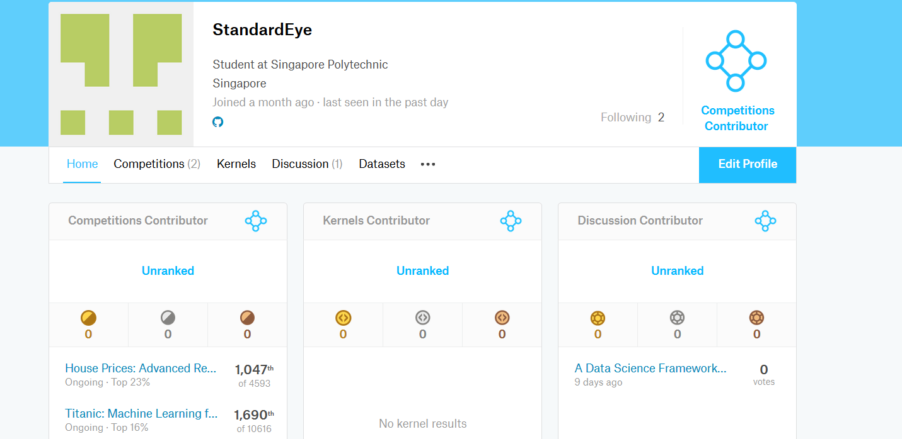

# AIML-CA1
The objective of the assignment is to help you gain a better understanding of machine learning tasks of regression and classification.
## Submission Results

## Part A: Classification
### Background
The sinking of the RMS Titanic is one of the most infamous shipwrecks in history.  On April 15, 1912, during her maiden voyage, the Titanic sank after colliding with an iceberg, killing 1502 out of 2224 passengers and crew. This sensational tragedy shocked the international community and led to better safety regulations for ships.

One of the reasons that the shipwreck led to such loss of life was that there were not enough lifeboats for the passengers and crew. Although there was some element of luck involved in surviving the sinking, some groups of people were more likely to survive than others, such as women, children, and the upper-class.

Complete the analysis of what sorts of people were likely to survive. In particular, we ask you to apply the tools of machine learning to predict which passengers survived the tragedy.

### Dataset
You are to use the dataset.
https://www.kaggle.com/c/titanic/data 

### Tasks
1. Write the code to solve the prediction task. Normally you would be using scikit-learn, but if you'd prefer to work with your own implementation of learning algorithms, or some other toolkit, that is fine.
2. Write a report detailing your implementation, your experiments and analysis. In particular, we'd like to know:
  - How is your prediction task defined? And what is the meaning of the output variable?
  -How do you represent your data as features?
  - Did you process the features in any way?
  - Did you bring in any additional sources of data?
  - How did you select which learning algorithms to use?
  - Did you try to tune the hyperparameters of the learning algorithm, and in that case how?
  - How do you evaluate the quality of your system?
  - How well does your system compare to a stupid baseline?
  - Can you say anything about the errors that the system makes? For a classification task, you may consider a confusion matrix.
  - Is it possible to say something about which features the model considers important? (Whether this is possible depends on the type of classifier you are using)
## Part B: Regression
### Background
Background
Ask a home buyer to describe their dream house, and they probably won't begin with the height of the basement ceiling or the proximity to an east-west railroad. With 79 explanatory variables describing (almost) every aspect of residential homes in Ames, Iowa, this challenges you to predict the final price of each home.

The Ames Housing dataset was compiled by Dean De Cock for use in data science education. It's an incredible alternative for data scientists looking for a modernized and expanded version of the often cited Boston Housing dataset. 

### Dataset
You are to use the dataset.
https://www.kaggle.com/c/house-prices-advanced-regression-techniques/data  

### Tasks
1. Write the code to solve the prediction task. Normally you would be using scikit-learn, but if you'd prefer to work with your own implementation of learning algorithms, or some other toolkit, that is fine.
2. Write a report detailing your implementation, your experiments and analysis. In particular, we'd like to know:
  -	How is your prediction task defined? And what is the meaning of the output variable?
  -	How do you represent your data as features?
  -	Did you process the features in any way?
  -	Did you bring in any additional sources of data?
  -	How did you select which learning algorithms to use?
  -	Did you try to tune the hyperparameters of the learning algorithm, and in that case how?
  -	How do you evaluate the quality of your system?
  -	How well does your system compare to a stupid baseline?
  -	Can you say anything about the errors that the system makes?
  -	Is it possible to say something about which features the model considers important?

### Submission Requirements
- Submit a zip file containing all the project files (python files or notebook), all data sets used, and the report.

### Evaluation Criteria
- Application of suitable algorithms 	20%
- Suitable evaluation of algorithms 	20%
- Background research 			15%
- Quality of report			20%
